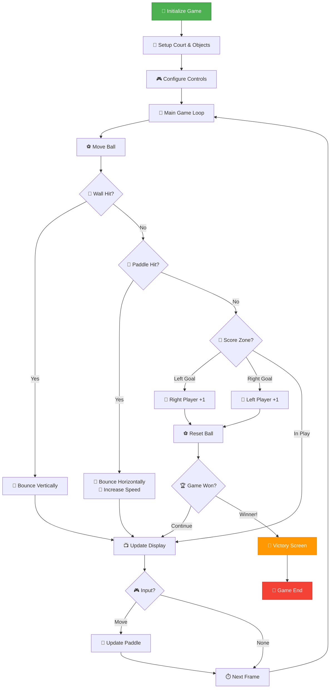
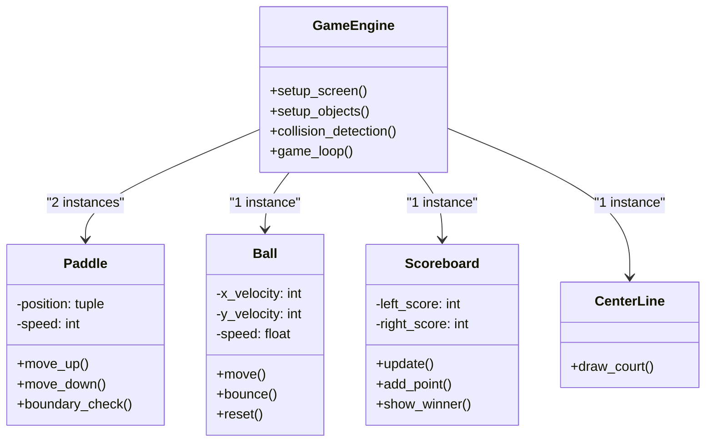

# 🏓 Enhanced Pong Game

[](https://www.python.org/downloads/)
[](https://docs.python.org/3/library/turtle.html)
[](https://github.com/qusai-Kagal/DevVault/tree/main/game-development)
[](https://github.com/qusai-Kagal/DevVault)
[](https://github.com/qusai-Kagal/DevVault/tree/main/game-development/enhanced-pong-game)

> 🎮 A professionally enhanced version of the classic Pong game featuring modern gameplay mechanics, polished UI, and clean code architecture - part of the **DevVault** collection

## 🌟 What Makes This Special

This isn't just another Pong clone! Built upon Angela Yu's 100 Days of Code foundation, this version transforms a basic tutorial into a production-ready game with professional enhancements:

### ✨ Key Enhancements
- 🏆 **Win Conditions** - Competitive gameplay with first-to-5 scoring
- 🎯 **Professional Court Design** - Authentic dotted center line
- 🚀 **Progressive Difficulty** - Ball acceleration system
- 🛡️ **Smart Boundaries** - Paddles can't escape the screen
- 🎨 **Victory Celebration** - Animated winner announcements
- ⚡ **Performance Optimized** - Smooth 60fps gameplay

## 🎮 Game Preview

```
    Player 1          🏓 ENHANCED PONG 🏓          Player 2
      (W/S)                                        (↑/↓)
      
        |                    5 : 3                   |
        |              .................             |
        |              .................             |
        █              .................             █
        █         ●    .................             █
        █              .................             █
        |              .................             |
        |              .................             |
        
    🏆 First to 5 points wins! 🏆
```

## 🚀 Quick Start

### 📋 Prerequisites
- Python 3.6 or higher
- Turtle graphics module (included with Python)

### ⚡ Run the Game
```bash
# Navigate to the game directory
cd game-development/enhanced-pong-game

# Launch the game
python main.py
```

## 🕹️ How to Play

### 🎮 Controls
| Player | Move Up | Move Down |
|--------|---------|-----------|
| **Left Player (1)** | `W` | `S` |
| **Right Player (2)** | `↑` | `↓` |

### 🏆 Game Rules
1. **Objective**: Prevent the ball from reaching your side
2. **Scoring**: Ball passes your paddle = opponent scores
3. **Victory**: First player to reach **5 points** wins
4. **Challenge**: Ball speed increases with each paddle hit

## 📁 Project Architecture

```
enhanced-pong-game/
├── 🎮 main.py          # Game engine & main loop
├── 🏓 paddle.py        # Paddle physics & controls
├── ⚽ ball.py           # Ball movement & collision
├── 📊 scoreboard.py    # Score tracking & winner display
├── ➖ center_line.py   # Professional court rendering
└── 📖 README.md        # This documentation
```

## 🧠 Technical Architecture

### 🔄 Game Flow Logic


### 🏗️ Class Structure


## 🔧 Key Technical Features

### 🎯 Enhanced Collision Detection
```python
# Old: Basic circular collision
if ball.distance(paddle) < 50:
    ball.bounce()

# New: Precise rectangular collision
if (ball_x > paddle_boundary and 
    ball_y < paddle.ycor() + 50 and 
    ball_y > paddle.ycor() - 50):
    ball.bounce()
```

### 🛡️ Boundary Protection System
```python
def go_up(self):
    new_y = self.ycor() + PADDLE_SPEED
    if new_y <= SCREEN_TOP_BOUNDARY:  # Prevents off-screen movement
        self.goto(self.xcor(), new_y)
```

### 🚀 Progressive Difficulty
```python
def bounce_x(self):
    self.x_move *= -1
    self.move_speed *= 0.9  # Ball gets 10% faster each hit
```

## 🎨 Customization Options

### 🎮 Game Settings (main.py)
```python
# Adjust game parameters
WINNING_SCORE = 5        # Change victory condition
PADDLE_SPEED = 20        # Paddle responsiveness  
BALL_SPEED_INCREASE = 0.9 # Difficulty progression
SCREEN_WIDTH = 800       # Court dimensions
SCREEN_HEIGHT = 600
```

### 🎨 Visual Customization
```python
# Colors & Appearance
SCREEN_COLOR = "black"   # Background color
PADDLE_COLOR = "white"   # Paddle color
BALL_COLOR = "white"     # Ball color
SCORE_FONT = ("Courier", 80, "normal")
```

### 🕹️ Control Remapping
```python
# Customize control keys
RIGHT_PADDLE_UP = "Up"      # Default: Arrow Up
RIGHT_PADDLE_DOWN = "Down"  # Default: Arrow Down  
LEFT_PADDLE_UP = "w"        # Default: W
LEFT_PADDLE_DOWN = "s"      # Default: S
```

## 🔄 Evolution from Tutorial to Production

### 📚 Original Angela Yu Version
- ✅ Basic paddle movement
- ✅ Simple ball bouncing
- ✅ Score tracking
- ❌ No win conditions
- ❌ Paddles could go off-screen
- ❌ No visual polish

### 🚀 Enhanced DevVault Version
- ✅ **All original functionality preserved**
- ✅ **Professional win conditions** with victory celebration
- ✅ **Boundary-protected paddles** prevent off-screen bugs
- ✅ **Authentic court design** with dotted center line
- ✅ **Progressive difficulty** keeps gameplay engaging
- ✅ **Optimized collision detection** for better accuracy
- ✅ **Modular code architecture** with organized constants
- ✅ **Comprehensive documentation** for learning

## 🛠️ Development Insights

### 🎯 Code Quality Improvements
- **Constants Organization**: All magic numbers moved to configuration section
- **Modular Design**: Each component in separate, focused class
- **Error Prevention**: Boundary checking prevents common bugs
- **Performance**: Rectangular collision detection vs circular distance
- **Maintainability**: Clear documentation and logical structure

### 📈 Learning Outcomes
- **OOP Principles**: Inheritance, encapsulation, separation of concerns
- **Game Development**: Game loops, collision detection, state management
- **Python Best Practices**: PEP 8 compliance, type hints, documentation
- **Problem Solving**: Debugging, optimization, feature enhancement

## 🚀 Future Enhancement Ideas

### 🎵 Audio & Visual
- [ ] Sound effects for paddle hits and scoring
- [ ] Particle effects for ball collisions
- [ ] Custom themes and color schemes
- [ ] Smooth animations and transitions

### 🤖 Gameplay Features  
- [ ] AI opponent with difficulty levels
- [ ] Tournament mode with multiple rounds
- [ ] Power-ups and special abilities
- [ ] Statistics tracking and high scores

### 🌐 Technical Upgrades
- [ ] Port to modern game engines (Pygame, Arcade)
- [ ] Multiplayer networking support
- [ ] Mobile-responsive controls
- [ ] Save/load game progress

## 📊 Part of DevVault Collection

This Enhanced Pong Game is part of the **DevVault** - a curated collection of development projects showcasing various programming concepts and best practices.

### 🎮 Related Game Development Projects
- [🎯 Snake Game Enhanced](../snake-game/) - Coming Soon
- [🎲 Dice Rolling Simulator](../dice-simulator/) - Coming Soon  
- [🃏 Card Game Engine](../card-games/) - Coming Soon

### 🔗 Explore More Categories
- [🌐 Web Development](../../web-development/)
- [🤖 AI & Machine Learning](../../ai-ml/)
- [📊 Data Analysis](../../data-analysis/)
- [🔧 Utilities & Tools](../../utilities/)

## 📜 License & Attribution

**MIT License** - Feel free to use, modify, and distribute

### 🙏 Acknowledgments
- **Angela Yu** - Original Pong tutorial foundation (100 Days of Code)
- **Python Community** - Turtle graphics module
- **Classic Pong (1972)** - The game that started it all

## 📞 Connect & Contribute

**Qusai Kagalwala**
- 📧 **Email**: qusai.kagalwala53@gmail.com
- 💼 **LinkedIn**: [qusai-kagalwala](https://www.linkedin.com/in/qusai-kagalwala/)
- 🐙 **GitHub**: [@qusai-Kagal](https://github.com/qusai-Kagal)
- 🗂️ **DevVault**: [Explore All Projects](https://github.com/qusai-Kagal/DevVault)

---

<div align="center">

### 🎮 Ready to Experience Enhanced Pong? 🏓

**[🚀 Launch Game](#-quick-start) | [📚 Explore DevVault](https://github.com/qusai-Kagal/DevVault) | [🤝 Contribute](#-connect--contribute)**

Made with ❤️ as part of the **DevVault** collection

</div>
