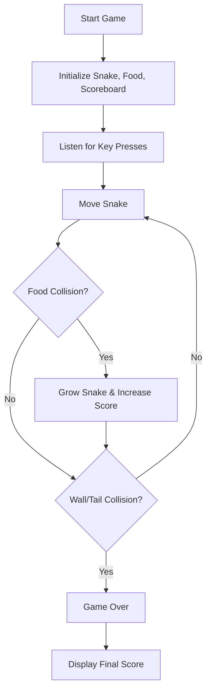

# 🐍 Snake Game


> A classic Snake game implementation using Python's Turtle graphics library. Control the snake to eat food, grow longer, and avoid collisions!

## 📖 Table of Contents

- [🎮 Game Overview](#-game-overview)
- [✨ Features](#-features)
- [🚀 Installation](#-installation)
- [🎯 How to Play](#-how-to-play)
- [🏗️ Project Structure](#️-project-structure)
- [💻 Code Architecture](#-code-architecture)
- [🔧 Customisation](#-customisation)
- [📸 Screenshots](#-screenshots)
- [🤝 Contributing](#-contributing)
- [📜 License](#-license)
- [👨‍💻 Author](#-author)

## 🎮 Game Overview

This is a modern implementation of the classic Snake arcade game, built as part of Angela Yu's 100 Days of Code Challenge (Days 21-22). The game features smooth gameplay, colorful food items, and collision detection for both walls and the snake's own tail.

### 🎯 Objective
- Control the snake using arrow keys
- Eat food to grow longer and increase your score
- Avoid hitting walls or your own tail
- Achieve the highest score possible!

## ✨ Features

- **🎨 Colorful Graphics**: Random colored food items for visual appeal
- **⌨️ Smooth Controls**: Responsive arrow key movement
- **🏆 Score Tracking**: Real-time score display and game over screen
- **🚫 Collision Prevention**: Prevents 180-degree turns to avoid instant death
- **📱 Responsive Design**: 600x600 pixel game window
- **🎮 Classic Gameplay**: Traditional Snake game mechanics

## 🚀 Installation

### Prerequisites
- Python 3.x installed on your system
- Turtle graphics library (included with Python)

### Setup Steps

1. **Clone the repository**
   ```bash
   git clone https://github.com/qusai-Kagal/DevVault.git
   cd DevVault/game-development/snake-game
   ```

2. **Run the game**
   ```bash
   python main.py
   ```

That's it! The game window should open and you can start playing immediately.

## 🎯 How to Play

### Controls
| Key | Action |
|-----|--------|
| ↑ | Move Up |
| ↓ | Move Down |
| ← | Move Left |
| → | Move Right |
| Click | Exit Game |

### Game Rules
1. **Movement**: The snake moves continuously in the direction you choose
2. **Food**: Eat the colored circles to grow longer and increase your score
3. **Growth**: Each food item adds one segment to your snake
4. **Walls**: Don't hit the boundaries of the game area
5. **Self-Collision**: Avoid running into your own tail
6. **Scoring**: Each food item is worth 1 point

## 🏗️ Project Structure

```
snake-game/
│
├── main.py         # 🎮 Main game loop and setup
├── snake.py        # 🐍 Snake class (movement, growth, controls)
├── food.py         # 🍎 Food class (generation, positioning)
├── scoreboard.py   # 🏆 Scoreboard class (score tracking, display)
└── README.md       # 📖 Project documentation
```

## 💻 Code Architecture

### 🏛️ Object-Oriented Design

The game follows a clean, modular architecture with four main classes:

#### 🐍 Snake Class (`snake.py`)
- **Purpose**: Manages snake creation, movement, and growth
- **Key Methods**:
  - `create_snake()`: Initialises 3-segment starting snake
  - `move()`: Updates positions of all segments
  - `extend()`: Adds new segment when food is eaten
  - `up()`, `down()`, `left()`, `right()`: Direction controls

#### 🍎 Food Class (`food.py`)
- **Purpose**: Handles food generation and appearance
- **Key Features**:
  - Random positioning within game boundaries
  - Multiple colors for visual variety
  - Automatic refresh when eaten

#### 🏆 Scoreboard Class (`scoreboard.py`)
- **Purpose**: Manages score display and game over messages
- **Key Methods**:
  - `update_scoreboard()`: Displays current score
  - `increase_score()`: Increments and updates score
  - `game_over()`: Shows end game message

#### 🎮 Main Game Loop (`main.py`)
- **Purpose**: Coordinates all game components
- **Responsibilities**:
  - Screen setup and configuration
  - Keyboard event handling
  - Collision detection (food, walls, tail)
  - Game state management

### 🔄 Game Flow



## 🔧 Customisation

### 🎨 Visual Modifications

**Change Snake Color:**
```python
# In snake.py, modify add_segment() method
new_segment.color("lime")  # Change from "white" to any color
```

**Modify Food Colors:**
```python
# In food.py, update the colors list
self.colors = ["red", "orange", "yellow", "green", "blue", "purple", "pink", "cyan"]
```

**Adjust Game Speed:**
```python
# In main.py, modify the sleep duration
time.sleep(0.05)  # Faster gameplay (0.1 = slower, 0.05 = faster)
```

### ⚙️ Gameplay Modifications

**Change Window Size:**
```python
# In main.py
screen.setup(width=800, height=800)  # Larger game area
```

**Modify Movement Distance:**
```python
# In snake.py
MOVE_DISTANCE = 30  # Larger steps (20 = normal, 30 = bigger steps)
```

## 📸 Screenshots

*Game in action with colorful food and score display*

## 🤝 Contributing

Contributions are welcome! Here are some ways you can help improve the project:

### 🌟 Feature Ideas
- [ ] High score persistence
- [ ] Difficulty levels (speed variations)
- [ ] Power-ups and special food items
- [ ] Sound effects and background music
- [ ] Multiplayer mode
- [ ] Different snake skins/themes
- [ ] Pause functionality
- [ ] Mobile touch controls

### 🐛 Bug Reports
If you find any bugs, please open an issue with:
- Description of the problem
- Steps to reproduce
- Expected vs actual behavior
- Your system information

### 🔧 Pull Requests
1. Fork the repository
2. Create a feature branch (`git checkout -b feature/amazing-feature`)
3. Commit your changes (`git commit -m 'Add amazing feature'`)
4. Push to the branch (`git push origin feature/amazing-feature`)
5. Open a Pull Request

## 📜 License

This project is licensed under the MIT License - see the [LICENSE](LICENSE) file for details.

## 👨‍💻 Author

**Qusai Kagalwala**
- 📧 Email: qusai.kagalwala53@gmail.com
- 🐙 GitHub: [@qusai-Kagalwala](https://github.com/qusai-Kagalwala)
- 💼 LinkedIn: [qusai-kagalwala](https://www.linkedin.com/in/qusai-kagalwala/)

---

### 🙏 Acknowledgments

- **Angela Yu** - For the excellent 100 Days of Code Python course
- **Python Turtle Graphics** - For providing an accessible graphics library
- **Classic Arcade Games** - For the timeless Snake game inspiration

---

⭐ **If you enjoyed this project, please give it a star!** ⭐
